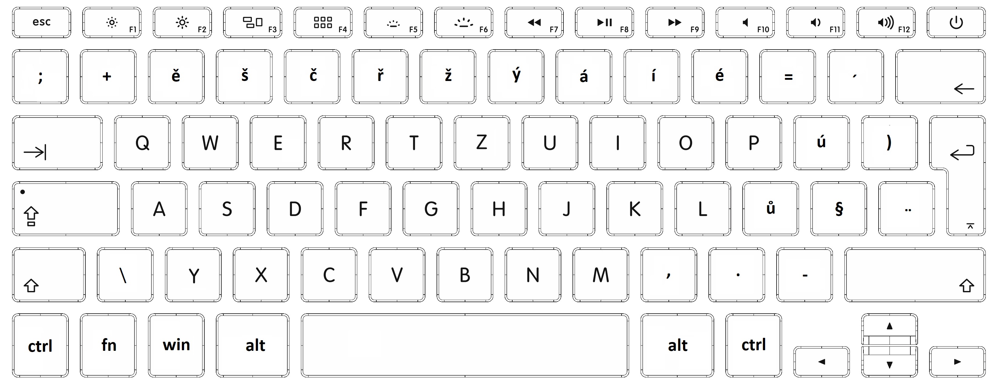

# Klávesové zkratky

V celém tutoriálu se používý česká qwertz klávesnice

Tento tutoriál bude rozdělen do dvou částí klávesové zkratky pro psaní **znaků** a pro **pohyb po klávesnici**

## Klávesové zkratky pro znaky

[Znaky](znaky.md)

## Klávesové zkratky pro pohyb po klávesnici

[Pohyb](pohyb.md)

## Rozvržení klávesnice se kterou pracujeme

