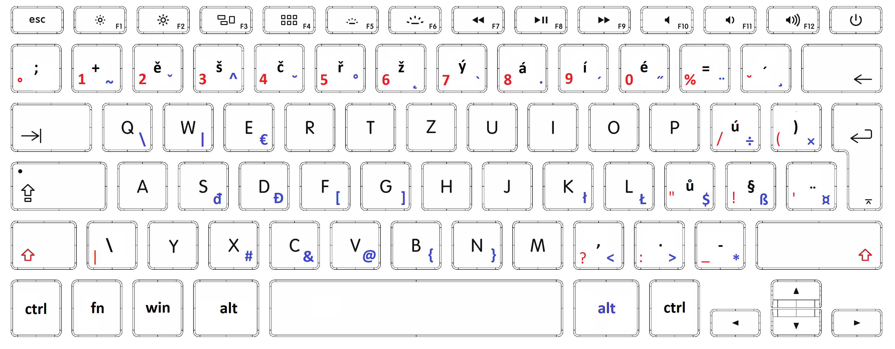

# Klávesové zkratky pro psaní znaků

[Zpět na úvodní stránku](readme.md)  
V této části se podíváme jak napsat různé druhy závorek `{}, []` nebo různé operátory `#, &, |, \` a mnoho dalšího.

## Závorky

Máme tři různé druhy závorek `(), [], {}`. Všechny tři jsou vhodné k jinému učelu do toho ale zabíhat nebudu z důvodu že aždy programovací jazyk to má jinak.

`()` - počátční napíšeme pomocí `shift + )` <- toto tlačítko najdete vedle enteru

`[]` - počáteční závorku napíšeme pomocí `pravý alt + f` a zavírací napíšeme pomocí `pravý alt + g`.

`{}` - počáteční závorku napíšeme pomocí `pravý alt + b`a zavírací napíšeme pomocí `pravý alt + n`.

## Speciální znaky pomocí pravého altu

Máme několik druhů logických operátorů a každý služí k různým věcem v různých programovacíhch jazycích
Pokud se Vám nějaký znak nenapsal stačí použít `space` a znak se zobrazí

`#` - hashtag `pravý alt + x`.  
`&` - logický and `pravý alt + c`.  
`@` - zavináč and `pravý alt + v`.
`<` - menší `pravý alt + ,`.  
`>` - větší `pravý alt + .`.  
`*` - hvězdička/násobení `pravý alt + -`. užitečné především proty co nedisponují numerickou klávesnicí.  
`$` - dolar `pravý alt + ů`.  
`ß` - ostré s `pravý alt + §`. (ocení především němčináři.)  
`\` - zpětné lomítko `pravý alt + q`.  
`|` - logický or `pravý alt + w`.  
`€` - euro `pravý alt + e`.  
`÷` - děleno `pravý alt + ú`.  
`×` - křížek `pravý alt + )`.  
`~` - negae `pravý alt + "+"`.  
`^` - stříška `pravý alt + š`.  
`°` - stupeň `pravý alt + ř`.

zpětný apostrof `pravý alt + ý`. (tady bohužel nemohu dát ukázku protože .md tento znak identifikuje jako kód více informací na [markdown](https://github.com/MarekDarsa/MarkDown#kód-v-textu))

## Emoji

Nejlepší a nejodnoduší způsob jak začít psát smajlíky je `win + .` 😁

nepopsal jsem všechny ale pouze ty se kterými jsem se setkal při svém běžném programování na obrázku níže budete mít uplně všechny i včetně těch které běžně nevyužijete

